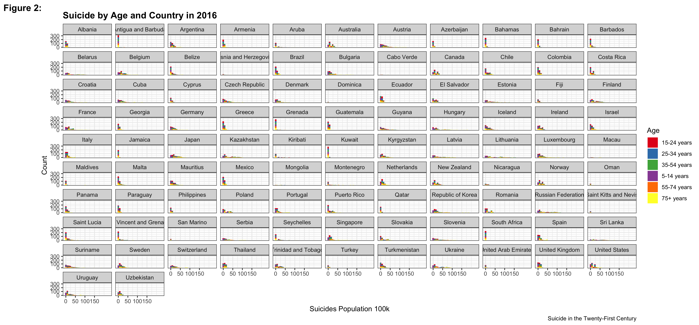

# Suicides Rates in Country

- __Project Purpose:__ Suicide is a serious public health problem, most at risks are those who has mental disorder. There is an association between the two such as depression, bipolor disorder, and many more that contributes. Every year 703,000 people take their own life and there are many more people who attempt suicide. Every suicide is a tragedy that affects families, communities and entire countries and has long-lasting effects on the people left behind. Suicide occurs throughout the lifespan and was the fourth leading cause of death among 15-29 year-olds globally in 2019. (https://www.who.int/news-room/fact-sheets/detail/suicide). 
__Suicide__ is defined as death caused by self-directed injurious behavior with intent to die as a result of the behavior.
__A suicide attempt__ is a non-fatal, self-directed, potentially injurious behavior with intent to die as a result of the behavior. A suicide attempt might not result in injury.
__Suicidal ideation__ refers to thinking about, considering, or planning suicide.
I decide to use this data to looking into the variables country, suicides population, generation and years. This project was for my own personal preference.


- __Tools used:__ I used R programming for this project and many packages: tidyverse, dplyr, tidyr, ggplot2, statar, and RColorBrewer. The final scripts are suicide.R shows the process of filtering years, transformation, and fixing up the data.

- __Results:__ 


- Shown in Figure 1, generation across each generation from 1985-2016, there is 6 generations in total from Boomers(1955 – 1964),  G.I., Gen Z(1997 – 2012), Gen X(1965 – 1980), Millenials(1981 – 1996), and Silent(1925 - 1945). As we can see, the highest suicides population 200k are in Silent and Boomers. The least is Gen Z and the largest to commit suicide are Silent, Boomers, and Gen X. This could be results of the Great Depression, WWI and WWII that could be link to these generations to commit suicide. 


- As illustrated in Figure 3, is a scatterplot of Suicide in Age by Country in the year of 1990. Macau and Oman have a low suicide population and the highest to be Canda, Austerial, Greece, and many other countries who have a higher peak in each state. Compare to figure 2 there has been an increase in suicide from 1990 to 2016.


- Presented in Figure 2, is a scatterplot of Suicide in Age by Country in the year of 2016. We can see there has been an increase in suicide in each country. There is a significant increase of number of suicide population compare to figure 3 in 1990.  Guyana, Lithuania, Russia, and Rupublic of Korea has an increase from 1990. Making them to be with the highest suicide rates (number of suicides per 100k).

- In conclusion from looking from the graphs, The older generation from Boomers, Gen Z, and Silent are more likely to commit suicide than other generations. There can be an association between war, depression, social economic, mental health or overal life satisfication. In compare to countries I can determine that the rate of sucides(number of suicides per 100k) are increase per year. This work matter because it demostrate the detrimental of suicide, which is the 4th leading cause of death. For the customers, it can help to look over the generation and countries to interupt and see the increase. My next steps in the data is to combine contients and possible creating a smaller graphs to represent the each country with in the years by rates of suicides. 


References
United Nations Development Program. (2018). Human development index (HDI). Retrieved from http://hdr.undp.org/en/indicators/137506

World Bank. (2018). World development indicators: GDP (current US$) by country:1985 to 2016. Retrieved from http://databank.worldbank.org/data/source/world-development-indicators#

[Szamil]. (2017). Suicide in the Twenty-First Century [dataset]. Retrieved from https://www.kaggle.com/szamil/suicide-in-the-twenty-first-century/notebook

World Health Organization. (2018). Suicide prevention. Retrieved from http://www.who.int/mental_health/suicide-prevention/en/
## Folder structure

```
- readme.md
- scripts
---- 
- data (less than 100 Mb)
---- master.csv
---- suicide.R
- documents
---- readme.md
---- figure2.png
---- figure3.png
---- generation.png

```
